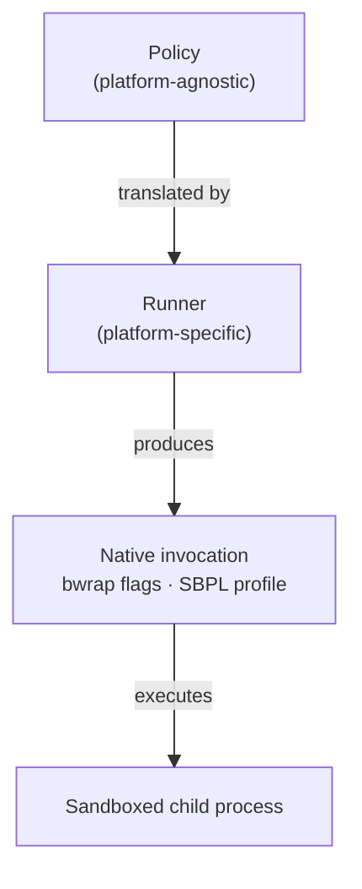
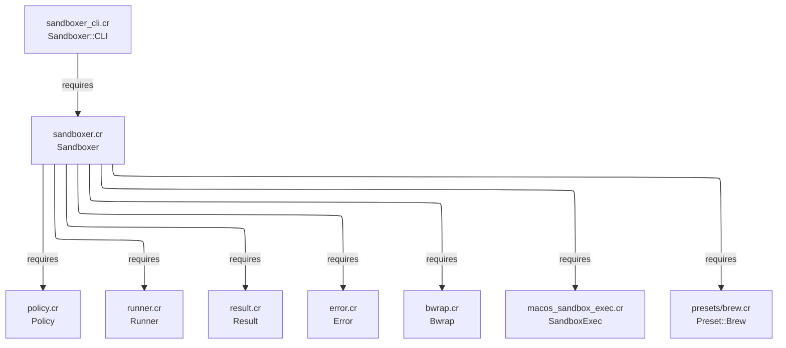
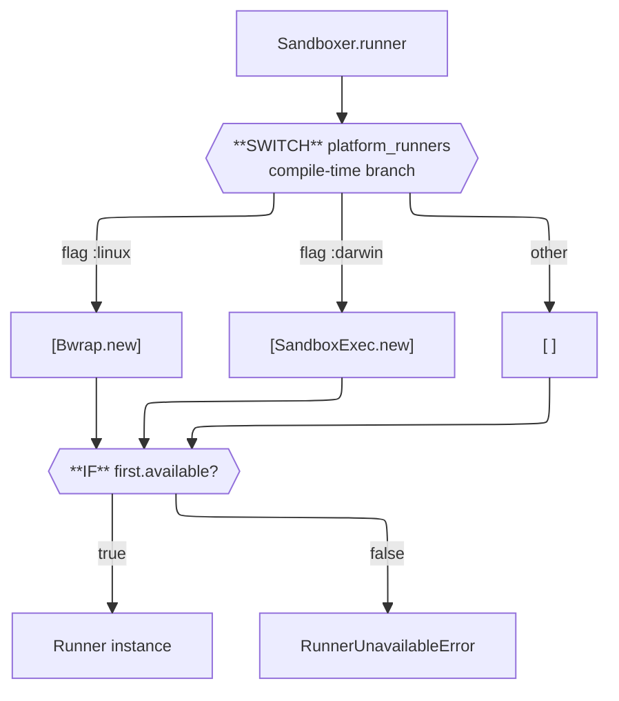

# Sandboxer Development

## Dependencies

1. Make sure you have `ops` installed, in one of the following ways:
   - as a gem via `gem install ops_team` or
   - as a tool via `brew tap nickthecook/crops && brew install ops`
2. If you are not using macOS, or a Linux that uses `apt`, please [install Crystal](https://crystal-lang.org/install/)

## Getting started

|Command                        |Description                                                                  |
|-------------------------------|-----------------------------------------------------------------------------|
|`ops up`                       |Gets everything set up including `crystal` via `apt` or `brew` if applicable.|
|`ops build-debug` or `ops bd`  |Make a debug build of `sandboxer`, in `bin/debug` folder.                    |
|`ops build-release` or `ops br`|Make a release / production build of `sandboxer`, in `bin/release` folder.   |
|`ops lint`                     |Run `ameba` on the source code.                                              |
|`ops test`                     |Run `crystal spec` on the source code.                                       |
|`ops clean`                    |Remove debug and release build files.                                        |
|`ops wipe`                     |In addition to cleaning, remove all compiler caches.                         |

### Build and run for development

Compile and run the `sandboxer` CLI as follows. Note that we use `--` separator twice, first to tell `crystal` which parameters to pass on to the running program, the second is to `sandboxer` so it knows the command to run in the sandbox.

```
ops run src/sandboxer_cli.cr -- run --policy YOUR_POLICY.json -- YOUR_COMMAND
```

### Build to run later

Run `ops build-release` to make a release build in `bin/release/`.

Run `ops build-debug` to make a debug build in `bin/debug/`.

## How Sandboxer works

### Design overview

Sandboxer is a thin translation layer. The core idea is that Linux (`bwrap`) and macOS (`sandbox-exec`) both let you wrap an arbitrary command in a sandbox — the same shape, different native languages. Sandboxer defines a platform-agnostic `Policy` that describes *what a process should be allowed to do*, and a `Runner` per platform that translates that policy into a native invocation.



Nothing in `Policy` knows about bwrap or SBPL. Nothing in a `Runner` is exposed at the library API surface beyond `available?` and `run`. This makes it straightforward to add a new platform without touching anything else.

### Source layout



The library entry point (`sandboxer.cr`) and the CLI entry point (`sandboxer_cli.cr`) are intentionally separate files. Users who `require "sandboxer"` get the library with no CLI code. The CLI requires the library and adds the `Sandboxer::CLI` module on top.

### The Policy

`Sandboxer::Policy` is a plain data class that captures what a sandboxed process is permitted to access. Every field has a safe default (deny network, empty path lists, new session). The full set of dimensions:

|Field             |Type                  |Default|Meaning                                              |
|------------------|----------------------|-------|-----------------------------------------------------|
|`read_only_paths` |`Array(String)`       |`[]`   |Paths the process may read but not write.            |
|`read_write_paths`|`Array(String)`       |`[]`   |Paths the process may read and write.                |
|`tmpfs_paths`     |`Array(String)`       |`[]`   |Scratch paths (in-memory tmpfs on Linux; see below). |
|`allow_network`   |`Bool`                |`false`|Whether outbound network access is permitted.        |
|`working_dir`     |`String?`             |`nil`  |Working directory inside the sandbox.                |
|`env`             |`Hash(String, String)`|`{}`   |Env vars to set explicitly inside the sandbox.       |
|`unset_env`       |`Array(String)`       |`[]`   |Env vars to strip (bwrap only; see below).           |
|`new_session`     |`Bool`                |`true` |Start a new session (setsid), preventing TTY escapes.|

`Policy` includes `JSON::Serializable`, so it round-trips to and from JSON with no extra code. Field defaults are declared inline on the properties (not in `initialize`) because `JSON::Serializable` generates its own initializer — defaults in `initialize` would be ignored when deserialising. A minimal valid policy file is `{}`.

Policies can be constructed programmatically via the `build` class method or loaded from a JSON file:

```crystal
# Programmatic
policy = Sandboxer::Policy.build do |policy|
  policy.read_only "/usr/share/myapp"
  policy.read_write "/tmp/workspace"
  policy.allow_network = false
end

# From file
policy = Sandboxer::Policy.from_json(File.read("policy.json"))
```

**Merging policies.** `Policy#merge(other)` returns a new `Policy` that combines `self` and `other`. Neither original is modified. Merge rules by field type:

|Field type                           |Rule                                      |
|-------------------------------------|------------------------------------------|
|Array fields (`*_paths`, `unset_env`)|Union, duplicates removed, order preserved|
|`allow_network`                      |`true` if either is true (OR)             |
|`new_session`                        |`true` if either is true (OR — safer)     |
|`working_dir`                        |`other` wins if set, else `self`          |
|`env` hash                           |Merged; `other` wins on key collision     |

Merge is the intended composition mechanism — build small, focused policies and combine them rather than constructing one large policy per use case.

**Presets.** `Sandboxer::Preset` contains pre-built `Policy` constants for common toolchains. Each preset is a normal `Policy` object and composes via `merge`:

```crystal
policy = my_policy.merge(Sandboxer::Preset::Brew::MACOS_ARM)
```

Preset files live in `src/sandboxer/presets/`. Adding a new preset means adding a file there, requiring it in `sandboxer.cr`, and adding specs. No runner code changes.

### The Runner abstraction

`Sandboxer::Runner` is an abstract class with two required methods:

```crystal
abstract def available? : Bool
abstract def run(command : Array(String), policy : Policy) : Result
```

`available?` checks whether the underlying sandbox binary exists on the current host. `run` performs the translation and executes the command, returning a `Result` with `exit_code`, `stdout`, and `stderr`. The protected `execute(argv)` helper on the base class handles subprocess spawning and output capture; concrete runners call it after building their argv.

`Sandboxer::Result` is a struct (value type) with `success?` as a convenience predicate over `exit_code == 0`.

Exit codes follow Unix conventions. When the sandboxed process exits via signal rather than normally, `execute` maps it to `128 + signal_number` (e.g. SIGABRT = signal 6 → exit code 134). `Process::Status#exit_code` raises on signal exits, so the mapping is done via `exit_signal?` before falling back.

### Linux: the Bwrap runner

`Sandboxer::Bwrap` translates a `Policy` into a `bwrap` flag list via `build_argv`. The key conceptual difference from the macOS approach: instead of evaluating path-based rules at access time, bwrap constructs a fresh **mount namespace** — a new view of the filesystem assembled entirely from explicit bind mounts. Anything not bound simply does not exist inside the sandbox.

**Environment.** bwrap passes the parent's full environment to the child by default. Sandboxer uses `--clearenv` and then explicitly re-adds a safe passthrough set (`PATH`, `TERM`, `LANG`, `LC_ALL`, `LANGUAGE`, `TZ`) plus any vars in `policy.env`. This is a safer default than inheriting everything. `policy.unset_env` adds `--unsetenv` flags for further stripping.

**Filesystem.** A set of system library paths (`/usr/lib`, `/lib`, `/usr/bin`, etc.) is bound read-only with `--ro-bind-try`, which silently skips any path that doesn't exist on the current distro. Policy `read_only_paths` use `--ro-bind` (hard error if absent) and `read_write_paths` use `--bind`. `tmpfs_paths` use `--tmpfs`, which mounts a fresh in-memory filesystem at that path — nothing written there is visible on the host or persisted after the process exits.

**Network.** `--unshare-net` creates a new network namespace with no NICs. Only loopback (`127.0.0.1`) exists inside. When `allow_network` is true, the flag is omitted and `/etc/resolv.conf` plus TLS certificate paths are bound read-only so DNS and HTTPS work.

**Process isolation.** `--unshare-pid` creates a new PID namespace; the sandboxed process sees itself as PID 1 and cannot observe host processes. `--new-session` calls `setsid()`, detaching from the controlling terminal.

**No root required.** bwrap uses unprivileged Linux user namespaces. Some hardened kernels disable these (`kernel.unprivileged_userns_clone=0`, common on older Debian derivatives). Call `available?` before use and surface a clear error if it returns false.

`build_argv` is public so callers can inspect or log the full command without executing it. The `inspect` subcommand in the CLI uses this.

### macOS: the SandboxExec runner

`Sandboxer::SandboxExec` translates a `Policy` into an **SBPL profile file** and invokes `sandbox-exec -f <profile> -- command`. SBPL (Sandbox Profile Language) is a Scheme-like DSL evaluated by Apple's Seatbelt framework — a MACF (Mandatory Access Control Framework) kernel module that hooks every syscall and evaluates it against the loaded policy.

**Profile generation.** `generate_profile` builds an SBPL string with `(deny default)` as the baseline, then adds explicit `(allow ...)` rules from the policy. The structure:

```scheme
(version 1)
(deny default)

; BASELINE — minimum for any process to start
(allow process-fork)
(allow process-exec)
(allow mach-lookup)    ; required by dyld and system frameworks
(allow sysctl-read)    ; read by libc on startup
(allow file-read* ...)  ; dyld, /usr/lib, /System/Library, basic devices
(allow file-read-metadata)
(allow file-read-data (literal "/"))  ; root path resolution

; POLICY — derived from Sandboxer::Policy
(allow file-read* (subpath "/your/ro/path"))
(allow file-read* file-write* (subpath "/your/rw/path"))
(allow network-outbound)  ; only if allow_network = true
```

`generate_profile` is public for the same reason as `build_argv` on the Linux runner — inspection and testing without execution.

**The BASELINE.** `(deny default)` blocks everything, including things most processes take for granted: dynamic linking, Mach IPC, basic sysctl reads. The `BASELINE` constant in `SandboxExec` is the minimum set of permissions for a process to start and link at all. In practice, some commands need additional Mach service lookups beyond the baseline. See the [Debugging — macOS](#macos-1) section for how to identify and add missing permissions.

**Tempfile lifecycle.** `sandbox-exec` reads the profile from a file path passed via `-f`. The file must exist for the duration of the child process. Sandboxer creates a tempfile with `File.tempfile`, writes the profile, flushes, runs the command, and cleans up in an `ensure` block:

```crystal
profile_file = File.tempfile("sbx_", ".sb")
begin
  profile_file.print(generate_profile(policy))
  profile_file.flush
  execute([BINARY, "-f", profile_file.path, "--"] + command)
ensure
  profile_file.close
  File.delete(profile_file.path) rescue nil
end
```

Note: the block form of `File.tempfile` returns `File`, not the block's return value, so it cannot be used here — the return type would fail to satisfy `: Result`.

**Path expansion.** All paths in the policy are expanded to absolute via `File.expand_path` before being written to the SBPL profile. SBPL does not resolve relative paths — passing `"./"` would silently match nothing.

**tmpfs.** macOS does not support mounting tmpfs at arbitrary paths. `tmpfs_paths` on macOS grant RW access to the specified path on the real filesystem instead. For true scratch isolation, pass a path created with `Dir.tempdir` and clean it up after the process exits.

**Deprecation.** `sandbox-exec` has been marked deprecated in macOS SDK headers since 10.8 but remains functional through current releases. The intended replacement (App Sandbox) requires code signing and an app bundle — unsuitable for a general command wrapper. Chromium and Firefox both depend on `sandbox-exec` for their renderer sandbox on macOS. Treat it as deprecated-but-stable, with the caveat that a future macOS release could remove it without a public CLI alternative.

### Platform selection

`Sandboxer.platform_runners` uses Crystal compile-time flags to return the appropriate runner list:

```crystal

  [Bwrap.new] of Runner

  [SandboxExec.new] of Runner

  [] of Runner

```



All runners are compiled on all platforms — only the factory list is conditional. This means `Bwrap` and `SandboxExec` are both always available as classes, which is what allows the `inspect` subcommand to generate a Linux bwrap invocation from a macOS machine and vice versa.

`Sandboxer.runner` calls `available?` on the first runner in the list. If it returns false (e.g. bwrap not installed), it raises `RunnerUnavailableError` with a clear message. The list is ordered by preference; a future multi-runner platform could add fallbacks simply by appending to the list.

### The CLI

The CLI lives in `sandboxer_cli.cr` as `Sandboxer::CLI`, separate from the library. `CLI.run(argv)` takes a string array and returns an exit code — this makes subcommands directly testable without spawning a subprocess.

**Subcommand routing** is a simple `case` on `argv.shift`. Each subcommand is a private class method (`cmd_run`, `cmd_inspect`, `cmd_check`) that parses its own flags with Crystal's `OptionParser`.

**The `--` separator** in `run` is mandatory and parsed before `OptionParser` sees the flags. `argv.index("--")` splits the array into sandbox flags (left) and the command to run (right). This prevents flag collision when the sandboxed command has its own flags (`sandboxer run --policy p.json -- ls --all`).

**CLI overrides.** `--allow-network` and `--no-network` on `run` override the policy file's `allow_network` field after loading. This supports one-off overrides without editing the policy file.

**`inspect` is cross-platform.** Because both runners are always compiled, `--platform linux` works on macOS and `--platform macos` works on Linux. This is useful for reviewing what a policy will produce before deploying to a different OS.

**Exit codes** follow Unix conventions: `0` for success, `1` for any Sandboxer-level error. The exit code of the sandboxed command is propagated directly when `run` succeeds.

### Adding a new platform

To add a runner for a new platform (e.g. FreeBSD via `jail(8)`):

1. Create `src/sandboxer/freebsd_jail.cr` with a class inheriting `Sandboxer::Runner`.
2. Implement `available?` (check for the binary) and `run` (translate policy to flags, call `execute`).
3. Add a public inspection method (`build_argv` or similar) for use by `inspect`.
4. Add `require "./sandboxer/freebsd_jail"` to `sandboxer.cr`.
5. Add `FreeBSDJail.new` to the `` branch in `platform_runners`.
6. Add the runner to the `runners` array in `cmd_check` in the CLI.
7. Add a `when "freebsd"` branch in `cmd_inspect`.
8. Add specs covering `build_argv` structure and the `available?` / `run` contract.

No other files need to change. The `Policy` is already complete — the new runner only needs to map existing fields to its native invocation.

### Known limitations

**macOS BASELINE completeness.** The `BASELINE` in `SandboxExec` covers the minimum for most commands, but some tools need additional Mach service names or file paths. See [Debugging — macOS](#macos-1) for the workflow. Contributions that extend the baseline for common cases (e.g. Python, Node, shell built-ins) are welcome.

**tmpfs on macOS.** `tmpfs_paths` has different semantics on macOS than on Linux. Documented in-code, but callers should be aware.

**No syscall filtering on Linux.** `bwrap` has no built-in syscall filter. Adding one requires compiling a seccomp-bpf filter and passing it via `--seccomp <fd>`. The `Policy` has no field for this yet — a `denied_syscalls` or `seccomp_profile` field is a natural extension.

**Windows.** Not implemented. The right approach is a small native shim (`sandboxer-shim.exe`) that creates an AppContainer and exec's an arbitrary command, invoked by a `Sandboxer::AppContainer` runner subclass. See `ARCHITECTURE.md` for the design discussion.

**Environment passthrough on macOS.** `sandbox-exec` inherits the full parent environment. There is no SBPL mechanism to strip or override env vars. If env isolation matters on macOS, the caller must sanitise the environment before invoking Sandboxer.

## Debugging

Before reaching for the platform violation log, use `sandboxer inspect` to review the exact profile or flag list that will be used:

```sh
sandboxer inspect --policy policy.json --platform macos
sandboxer inspect --policy policy.json --platform linux
```

This prints the generated SBPL or bwrap argv without executing anything, making it easy to spot missing paths or unexpected allow rules before running the command.

### macOS

On macOS, denied operations are logged by the kernel's Sandbox subsystem. Stream denials in real time by running this in a separate terminal before invoking `sandboxer run`:

```sh
log stream --predicate 'eventMessage contains "deny"' --level debug
```

Each denial line names the process, the operation, and the path:

```
kernel: (Sandbox) Sandbox: find(83245) deny(1) file-read-data /
```

The operation name maps directly to an SBPL allow rule. For the line above:

```scheme
(allow file-read-data (literal "/"))
```

**Workflow for hardening the BASELINE:**

1. Run the failing command and observe denial lines in the log stream.
2. Add the denied operation to `BASELINE` in `macos_sandbox_exec.cr` if it is required by all processes, or to the policy's path lists if it is path-specific.
3. Rebuild and retest.
4. Repeat until no denials appear and the command exits cleanly.

**Reading the exit code.** Signal exits typically mean a critical operation was denied during process startup before any output was produced. The mapping is `exit_code = 128 + signal_number`, so exit code 134 = SIGABRT (signal 6). This almost always points to a missing dyld or Mach IPC permission in the BASELINE rather than a policy path issue.

**Architecture-specific BASELINE entries.** The dyld shared cache lives at different paths on Intel and Apple Silicon:

|Architecture  |dyld shared cache path             |
|--------------|-----------------------------------|
|Intel (x86_64)|`/private/var/db/dyld`             |
|Apple Silicon |`/System/Volumes/Preboot/Cryptexes`|

Both are in the BASELINE. SIGABRT with no denial lines is the symptom when the wrong one is missing.

**Benign log noise.** The following kernel message is harmless and can be ignored — it is not a sandbox denial:

```
sandboxer[PID] triggered unnest of range ... of DYLD shared region
```

This appears when `sandbox-exec` intercepts process startup and causes the kernel to create a private copy of a dyld shared region. It is a normal side effect of the sandbox mechanism.

**Iterating without rebuilding.** Use `sandboxer inspect` to write the SBPL to a file and test it directly with `sandbox-exec`, avoiding a full rebuild cycle:

```sh
sandboxer inspect --policy policy.json --platform macos > /tmp/profile.sb
sandbox-exec -f /tmp/profile.sb -- your-command
```

Once the profile works, bring the additions back into the BASELINE or policy and rebuild.

## Contributions

See [README](./README.md)
